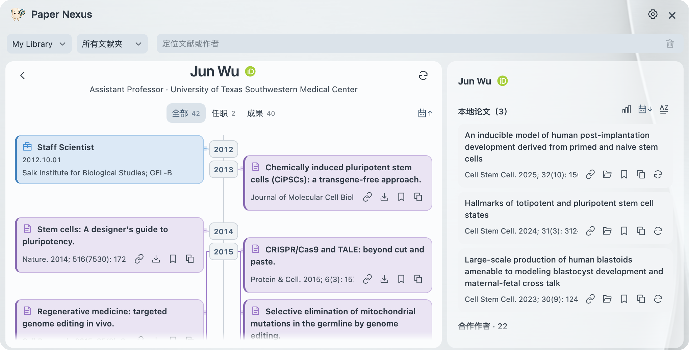

<b>From a citation to a research community.</b>

<a href="README.md">简体中文</a> · <b>English</b>

<a href="https://github.com/JunyanKang/paper-nexus/releases/latest"><b>Download</b></a> · <a href="#get-started">Get started</a> · <a href="docs/GUIDE.md">User guide (中文)</a>

Paper Nexus is a free Zotero plugin for following research connections. Preview cited papers, read and translate abstracts, save papers for later, and explore the people behind your library.

## Stay with the paper

Hover over a citation to see the cited paper and its publication details. Hover over its title to read the abstract, then switch between **original, translated, and bilingual** views without leaving the page.

## Keep the next lead

Move between the current paper’s references and your reading list. Save a paper, open a library item, copy a formatted citation, or return to where it was cited. The same actions are available on papers in the network and career view.

## Explore a research community

The **coauthor network** connects authors through papers in your Zotero library. Choose a collection, search for a name, explore collaborators, and read their papers. Shared publications determine the strength of connections.

## Follow an academic journey

Open the career view for an author with a linked ORCID. Browse public education, employment, funding, and research outputs over time, with papers from your own library alongside them.

## Get started

Supports **Zotero 10.0.5–10.0.x**. macOS and Windows use the same **XPI** file.

1. Download the XPI from [Releases](https://github.com/JunyanKang/paper-nexus/releases/latest). Do not unzip it.
2. In Zotero, choose **Tools → Plugins → gear menu → Install Plugin From File**.
3. Open a PDF and hover over a citation, or click the Nexus icon in the library toolbar to explore coauthors.

Reference previews and the coauthor network require no account. For abstract translation, choose a translation service or configure your own LLM API. Public abstracts and ORCID records vary in completeness. Screenshots show the Chinese interface; the interface language is configurable.

## Documentation

The detailed guides are in Chinese.

<table align="center">
<tr><th align="left">Guide</th><th align="left">What it covers</th></tr>
<tr><td><a href="docs/INSTALL.md">Installation</a></td><td>Download, install, and update</td></tr>
<tr><td><a href="docs/GUIDE.md">Reading</a></td><td>References, abstracts, saving, and citations</td></tr>
<tr><td><a href="docs/NETWORK.md">Coauthors and careers</a></td><td>Explore people, papers, and public records</td></tr>
<tr><td><a href="docs/SETTINGS.md">Settings</a></td><td>Translation, citation styles, appearance, and language</td></tr>
<tr><td><a href="docs/FAQ.md">FAQ</a></td><td>Recognition, missing information, and connection issues</td></tr>
</table>

<a href="docs/PRIVACY.md">Privacy</a> · <a href="CHANGELOG.md">Release notes</a> · <a href="https://github.com/JunyanKang/paper-nexus/issues">Feedback</a> · <a href="CONTRIBUTING.md">Contribute</a> · <a href="LICENSE">MIT License</a>

