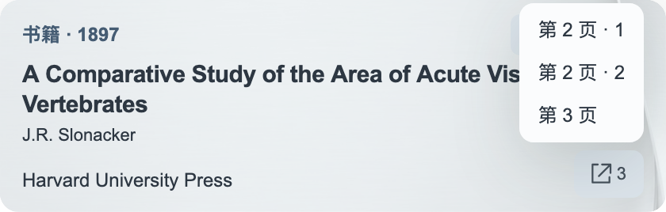

<h1 align="center">从一处引文，走进一张文献网络。</h1>

<b>简体中文</b> · <a href="README.en.md">English</a>

在 Zotero 里看懂引用、对照摘要、收下线索。 再沿着作者、主题和参考文献，找到下一篇值得读的论文。

<b>引文悬浮卡片 · 双语摘要 · 本地多中心网络</b>

<a href="#下载与安装">下载与安装</a> · <a href="docs/GUIDE.md">图文使用指南</a> · <a href="https://github.com/JunyanKang/paper-nexus/issues">反馈与建议</a>

## 这句话引用了谁？停一下鼠标就知道

阅读不必总在正文和文末之间来回。鼠标悬停编号、上标或作者年份引文，对应文献就在旁边展开；遇到多篇连引，卡片连续排列，直接比较。

**题名、作者、年份、期刊，以及可获取的 IF 与 Q 分区**集中呈现。题名后的链接图标打开 DOI；已有文献显示具体文献夹，点击即可回到库中条目。

## 先读摘要，再决定要不要深入

悬停题名，在卡片旁展开摘要。**原文、译文、双语**随手切换；双语逐句对照，用轻浅的背景区分。遇到术语，目光就近回到原句。

窗口可以拖动、调整宽高，也能吸附在卡片的上下左右。阅读时留在手边，点击正文其他位置再收起。

翻译可选 **腾讯、微软、Google**，或接入自己的**大模型 API**。PubMed／PMC 摘要查询无需填写 API key 即可开始。[摘要与翻译 →](docs/GUIDE.md#读摘要与译文)

## 让文献库，从列表变成可以探索的地图

同一方向有谁在做？两个研究主题之间，哪些论文把它们联系起来？Paper Nexus 从本地文献出发，让多个研究群落自然展开。

| 想看清什么 | 怎样探索 |
|---|---|
| 作者之间的研究联系 | 切换**作者**，查看作者之间的合作与共同论文 |
| 文献覆盖了哪些研究内容 | 切换**主题**，查看研究主题，点击展开论文 |
| 某篇论文位于哪里 | 搜索题名或作者，直接定位到网络中 |
| 下一篇值得读的论文 | 点击节点，查看摘要与关联；需要时**聚焦关联** |
| 还缺哪些参考文献 | 点**扩展引文**，把库外参考加入当前网络 |

**没有指定的中心论文。** 群落根据关系自行排列，群落之间保留联系。同一对节点只画一条连线，线宽随去重后的关联依据增加；点击节点查看具体关系。总览呈现主题或作者，论文按需展开；双指平移、捏合缩放，也可以拖动节点调整位置。

**主题与作者是两种不同的观察方式。** 主题节点按题名与摘要中的研究内容组织，点击展开论文；作者节点按完整署名跨年份汇总，以共同发表的论文连接。扩展引文沿用这套规则，已在本地库中的同一篇文献合并显示。

新增、修改或删除 Zotero 条目后，网络在后台更新，复用未改变内容的计算结果。进度显示在画面角落，已有网络仍可浏览。选中论文可打开本地条目或全文，库外文献可直接保存。[探索文献网络 →](docs/NETWORK.md)

### 一个 XPI，带上本地模型一起安装

**完整安装包约 22.5 MB，已内置语义模型、分词器和运行组件。** 安装后即可基于自己的 Zotero 文献库建立网络，无需另下模型、配置 API Key 或先训练。

只有题名也能参与主题分析，已有摘要会提供更多内容。第一次打开所选库或文献夹时，在本机建立语义索引并显示进度；后续复用缓存，按文献变化更新。每个人看到的网络来自自己的文献，安装包不携带他人的书目或预先生成的网络。

需要更凝练的主题名称时，可在**常规 → 主题分析**启用**大模型 · API**，为已形成的主题提炼名称。翻译与主题命名可共用同一服务商的密钥，分别选择模型。默认本地主题分析无需联网；摘要查询、在线翻译等服务按需联网。

## 有价值的线索，顺手留下

**稍后读**先收下线索；**保存**选择已有或新建文献夹。已经在库中的论文直接打开，卡片同时告诉你它放在哪里。

**定位引用**回到论述现场。悬停定位图标与数字，展开紧凑的引用位置列表；点击返回正文，当前处用底色区分。

**复制引文**按你的写作格式输出。内置 **33 种 CSL 格式入口**，包括 APA、AMA、MLA、NLM、Vancouver，以及 Nature、Science、Cell、PNAS、NEJM、JAMA、eLife、PLOS、Development、IOVS 等。[选择引文格式 →](docs/GUIDE.md#常规)

## 顺手，也顺眼

设置只有 **常规、外观** 两页。数据与翻译放在一起，更新操作收在底部；主题、字体、字号与界面语言集中在外观页。

10 套主题、自定义背景与透明度，让卡片、摘要、菜单和文献网络保持一致。Paper Nexus 与 [Paper Voice](https://github.com/JunyanKang/paper-voice) 是同系列伙伴：一个帮助追踪论文联系，一个陪伴听读。

 

## 下载与安装

适用于 **Zotero 10.0.5–10.0.x**。插件免费开源，无需另装 Python 或 Node.js。

当前版本 **0.4.8**，已包含本地语义模型。新用户下载完整 XPI；已有用户可通过插件内更新入口升级。

**[下载 0.4.8 完整安装包 →](https://github.com/JunyanKang/paper-nexus/releases/tag/v0.4.8)**

1. 获取 **paper-nexus-版本号.xpi** 完整包；公开版本在发布页 Assets 中下载，无需下载源码 ZIP 或独立模型。
2. Zotero → **工具 → 插件 → 齿轮 → 从文件安装插件**，选择 XPI。
3. 打开 PDF，悬停正文引文；点击工具栏的纸张放大镜图标，开始探索。

已有用户可在 **设置 → 常规底部 → 检查更新** 升级，也可开启自动更新。设置与稍后阅读清单继续保留。

**[打开图文使用指南 →](docs/GUIDE.md)** · [安装帮助](docs/INSTALL.md) · [常见问题](docs/FAQ.md)

[隐私说明](docs/PRIVACY.md) · [更新记录](CHANGELOG.md) · [参与开发](CONTRIBUTING.md)

Created by [Junyan Kang](https://github.com/JunyanKang) · [MIT License](LICENSE)
