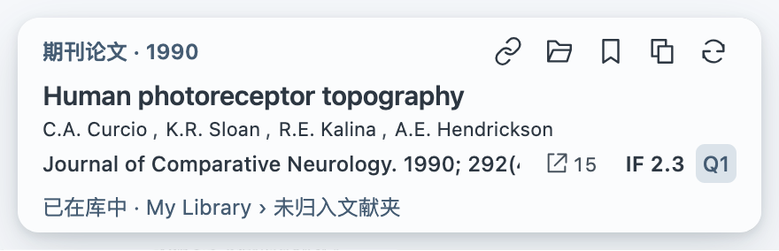
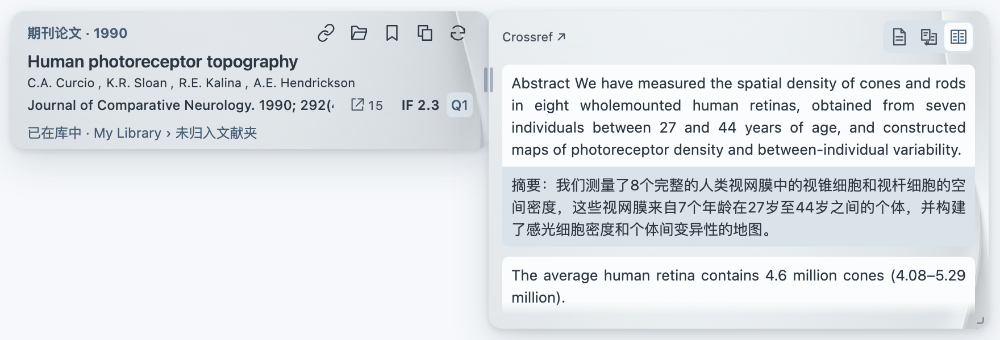
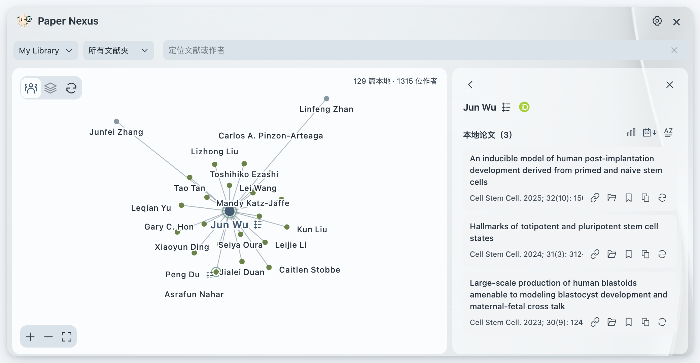

<h1 align="center">Paper Nexus</h1>

<b>从眼前的引用，发现下一条研究线索。</b>

看清引文 · 对照摘要 · 探索研究网络

<b>简体中文</b> · <a href="README.en.md">English</a>

<a href="https://github.com/JunyanKang/paper-nexus/releases/latest"><b>下载 Paper Nexus</b></a> · <a href="docs/INSTALL.md">安装指南</a> · <a href="docs/GUIDE.md">开始使用</a>

Paper Nexus 是一款免费的 Zotero 插件，把引文信息、摘要阅读与文献网络带到同一个研究空间。阅读一篇论文时，随手了解它引用的工作；回到自己的文献库，又能沿着作者与合作关系发现值得继续追踪的论文。

## 看清一处引用，留住阅读思路

这句话引用了哪篇论文？把鼠标停在引文上，题名、作者、期刊与可获取的期刊指标就在旁边展开。查看原文、跳回引用位置，把值得读的论文留下来，无需在正文与参考文献表之间反复翻找。

看清引用的来源，把有价值的线索随手留下。

## 先读摘要，再决定深入

悬停论文题名，即可阅读摘要。用**原文、译文、双语**三种方式理解研究内容，在一句原文与一句译文之间对照术语、方法和结论。摘要窗口可以移动和调整大小，让阅读保持连贯。

同一篇论文的原文与译文，就在手边。

## 从一个名字，发现一个合作圈

**朋友圈**把文献库中的作者与共同论文连接起来。搜索熟悉的名字，查看直接合作者，或再向外探索一层；点击作者，即可回到他们一起完成的研究。

看见谁与谁共同研究，再读他们做了什么。

从图谱作者姓名旁的学术履历图标，还能沿时间轴了解其公开的求学、任职与研究成果。

朋友圈自动准备，无需配置账号。新增文献后会随之更新，让你的研究收藏持续积累。可选择主题与界面语言；也可搭配 [Paper Voice](https://github.com/JunyanKang/paper-voice)，把阅读延伸为听读。

## 开始使用

适用于 **Zotero 10.0.5–10.0.x**，macOS 与 Windows 使用同一个插件文件。

1. 从[官方发布页](https://github.com/JunyanKang/paper-nexus/releases/latest)下载 **XPI**。
2. 在 Zotero 的 **工具 → 插件 → 齿轮 → 从文件安装插件** 中选择该文件。
3. 打开论文，悬停一处引文，开始探索。

[查看安装指南 →](docs/INSTALL.md)

## 文档与支持

<table align="center">
<tr><td align="center"><a href="docs/GUIDE.md">使用指南</a></td><td>从引文阅读到保存论文</td></tr>
<tr><td align="center"><a href="docs/NETWORK.md">文献网络</a></td><td>探索作者、合作关系与共同论文</td></tr>
<tr><td align="center"><a href="docs/SETTINGS.md">设置</a></td><td>阅读、翻译与外观</td></tr>
<tr><td align="center"><a href="docs/FAQ.md">常见问题</a></td><td>遇到问题时从这里查找</td></tr>
</table>

<a href="docs/PRIVACY.md">数据与隐私</a> · <a href="CHANGELOG.md">更新记录</a> · <a href="https://github.com/JunyanKang/paper-nexus/issues">反馈建议</a> · <a href="CONTRIBUTING.md">参与贡献</a>

Created by <a href="https://github.com/JunyanKang">Junyan Kang</a> · <a href="LICENSE">MIT License</a>

