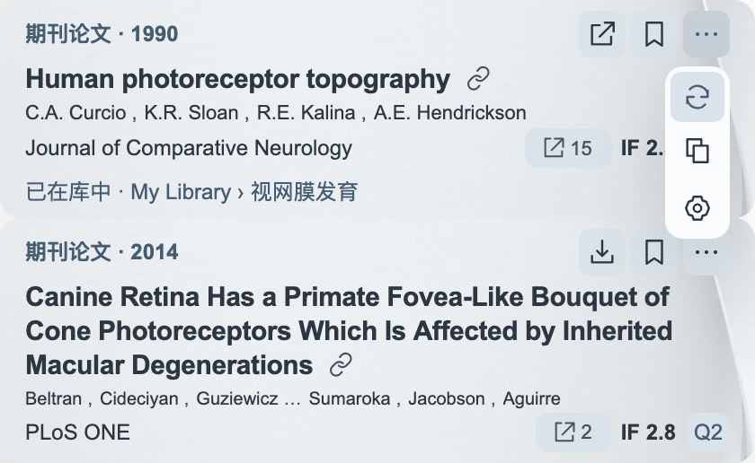

# Paper Nexus 使用指南

[安装与更新](INSTALL.md) · [返回首页](../README.md) · [文献网络](NETWORK.md) · [常见问题](FAQ.md)

## 从一处引文开始

打开 PDF，将鼠标停在正文的编号或作者年份引文上。对应文献以紧凑卡片显示，多篇连引会连续排列。

卡片集中显示题名、作者和出版信息。作者不超过六位时全部显示，超过六位保留前三与后三；期刊行显示可用的 IF 和 Q 分区，悬停可查看年份与学科。题名末尾的链接图标打开 DOI 页面。

右上角依次是**保存／打开、稍后读、更多**。已有文献会显示具体文献夹，保存按钮变为打开；更多菜单提供更新信息、复制引文和设置。

## 读摘要与译文

悬停题名，在文献旁边打开摘要，默认显示原文。顶部三个图标分别选择**原文、译文、双语**；双语按句配对，用不同背景区分两种文本。关键词直接显示在正文附近。

- 拖动顶部控件行的空白处，移动摘要窗口。
- 拖动四边或四角，调整宽高。
- 靠近文献卡片的上下左右边缘，松手后吸附。
- 鼠标离开题名后摘要保持打开；点击 PDF 其他位置、进入另一条文献或按 Esc 收起。

缺少摘要时会尝试公开来源，取得匹配结果后即可阅读或翻译；再次打开及查看网络时会复用已缓存的摘要。部分文献没有公开摘要。

每次打开摘要默认显示原文。需要更换翻译服务或语言时，打开“设置 → 阅读”下半部分。

## 回到正文引用位置

卡片和本篇文献列表中的**定位图标与数字**表示文内引用入口。只有一处时点击直接跳转；多处时悬停整个入口，向上展开紧凑位置列表。

每行显示页码，同页多次出现时增加序号；当前处以背景色标记。点击一行返回正文并短暂高亮。键盘也可用方向键选择、Enter 跳转。

## 稍后读与保存

点击书签，把文献加入稍后阅读。阅读器工具栏的 Paper Nexus 图标打开主面板，其中列表图标显示本篇参考文献，书签图标显示稍后阅读清单。

可搜索题名、展开行内详情、批量保存和导出 RIS。再次点击工具栏图标或点击 PDF 其他位置，面板会收起。

保存时先选择文献库和文献夹，也可新建子文献夹；下方可编辑书目信息。已有条目直接复用。清单中移除条目后，可以撤销。

## 打开文献网络

主面板右上角的网络图标打开本地文献网络。首行选库与文献夹，切换作者或主题；搜索题名／作者后选择结果，画面自动定位。

主题节点代表研究主题，点击展开论文；作者节点代表作者，点击查看论文与合作关系。单击画布空白返回上一级，双击空白返回全览。缩放旁的适应视图图标将当前层级完整放入画布。更多操作见 [文献网络指南](NETWORK.md)。

## 调整阅读体验

[设置与服务](SETTINGS.md) 分为阅读、网络、外观三页。阅读页管理翻译服务，网络页管理本地模型；主题、字体、字号和界面语言在外观页统一调整。

需要安装、切换或更新本地模型，参见 [模型选择](LOCAL-MODELS.md)。

### 更新文献网络

点击网络左上角的“更新网络”图标，可检查当前文献范围的缺失摘要并重新构建当前网络。已有有效摘要会直接复用；之前未找到的摘要会重新尝试。

主题网络会先完成这一轮摘要检查，再聚类和命名。更新期间保留上次完成的网络，进度显示在图内；没有旧网络时显示准备动画。公开来源确实未提供摘要的论文会使用题目信息，连接失败则保留原网络并提示重试。朋友圈依据作者和合著关系构建，无需等待摘要。

准备工作也会在后台低速进行，优先处理当前阅读的论文及正在查看的文献范围。升级算法或摘要获取方式后，插件会自动检查需要更新的内容，不必每次打开都重新下载或计算。
