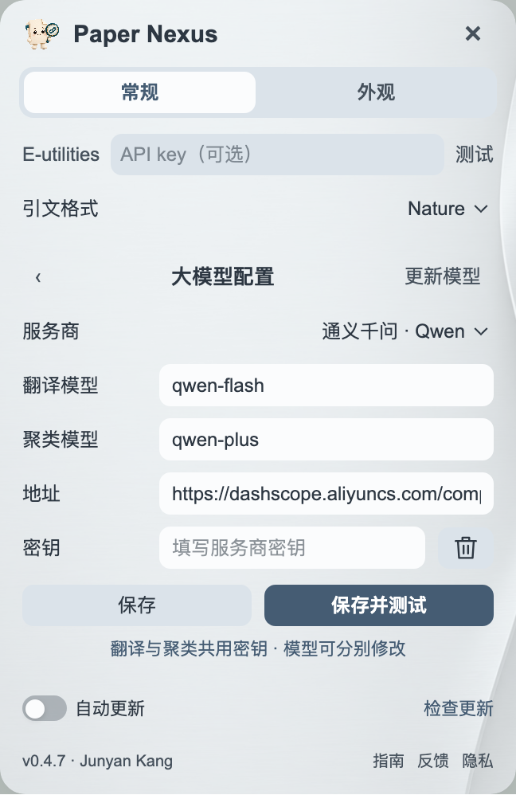

# Paper Nexus 使用指南

[安装与更新](INSTALL.md) · [返回首页](../README.md) · [文献网络](NETWORK.md) · [常见问题](FAQ.md)

## 从一处引文开始

打开 PDF，将鼠标停在正文的编号或作者年份引文上。对应文献以紧凑卡片显示，多篇连引会连续排列。

卡片集中显示题名、作者和出版信息。作者不超过六位时全部显示，超过六位保留前三与后三；期刊行显示可用的 IF 和 Q 分区，悬停可查看年份与学科。题名末尾的链接图标打开 DOI 页面。

右上角依次是**保存／打开、稍后读、更多**。已有文献会显示具体文献夹，保存按钮变为打开；更多菜单提供更新信息、复制引文和设置。

## 读摘要与译文

悬停题名，在文献旁边打开摘要。顶部三个图标分别选择**原文、译文、双语**；双语按句配对，用不同背景区分两种文本。关键词直接显示在正文附近。

- 拖动顶部控件行的空白处，移动摘要窗口。
- 拖动四边或四角，调整宽高。
- 靠近文献卡片的上下左右边缘，松手后吸附。
- 鼠标离开题名后摘要保持打开；点击 PDF 其他位置、进入另一条文献或按 Esc 收起。

插件会记住最近选择的显示模式。需要更换翻译服务或语言时，打开“设置 → 常规”下半部分。

## 回到正文引用位置

卡片和本篇文献列表中的**定位图标与数字**表示文内引用入口。只有一处时点击直接跳转；多处时悬停整个入口，向上展开紧凑位置列表。

每行显示页码，同页多次出现时增加序号；当前处以背景色标记。点击一行返回正文并短暂高亮。键盘也可用方向键选择、Enter 跳转。

## 稍后读与保存

点击书签，把文献加入稍后阅读。阅读器工具栏的 Paper Nexus 图标打开主面板，其中列表图标显示本篇参考文献，书签图标显示稍后阅读清单。

可搜索题名、展开行内详情、批量保存和导出 RIS。再次点击工具栏图标或点击 PDF 其他位置，面板会收起。

保存时先选择文献库和文献夹，也可新建子文献夹；下方可编辑书目信息。已有条目直接复用。清单中移除条目后，可以撤销。

## 打开文献网络

主面板右上角的网络图标打开本地文献网络。首行选库与文献夹，切换作者或主题；搜索题名／作者后选择结果，画面自动定位。

主题节点代表研究主题，点击展开论文；作者节点代表作者，点击查看论文与合作关系。点“聚焦关联”集中浏览邻域。“扩展引文”继续加入参考文献；“全景”返回整体。更多操作见 [文献网络指南](NETWORK.md)。

## 设置

设置只有 **常规、外观** 两页。

### 常规

上半部分处理文献信息：

- **E-utilities**：API key 可留空。点击名称打开注册页面；填写后离开输入框保存，点击“测试”确认连接。
- **引文格式**：选择 APA、AMA、MLA、NLM、Vancouver 或常用生命科学／医学期刊格式。随后在文献更多菜单点复制图标，得到对应格式的参考文献。

下半部分设置摘要翻译：

- **翻译服务**：腾讯、微软、Google 或“大模型 · API”。
- **译文语言**：选择摘要要翻译成的语言。
- **译文字号**：调整阅读大小；字体跟随外观页。

点击**配置大模型**，选择服务商并填写一次 API Key。插件自动填好接口地址，以及各自的翻译、聚类初始模型；两个模型都可以手动修改。同一服务商的两项任务共用密钥，自定义接口则填写自己的地址与模型名称。

**保存并测试**会分别显示翻译与聚类模型的连接结果。保存配置不会自动切换翻译服务，也不会自动发送文献库；要使用大模型翻译，请在翻译服务中选择“大模型 · API”。

右上角的**更新模型**同步 Paper Nexus 官方维护的全部厂商推荐模型和接口预设，无需重新安装插件。使用默认模型的配置会跟随更新；手动修改的模型和已有密钥对应的接口地址会保留。更换接口地址时，需填写该地址对应的密钥。

翻译设置下方是**自动更新／检查更新**，底部保留版本、指南、反馈与隐私入口。

### 外观

点击方块选择主题，点击“…”展开更多主题，也可导入自己的背景图片。透明度只调整背景，字体、字号和界面语言统一应用于卡片、摘要、菜单与网络。

界面语言与摘要翻译语言分别设置，例如使用中文界面阅读英文原文或日文译文。
