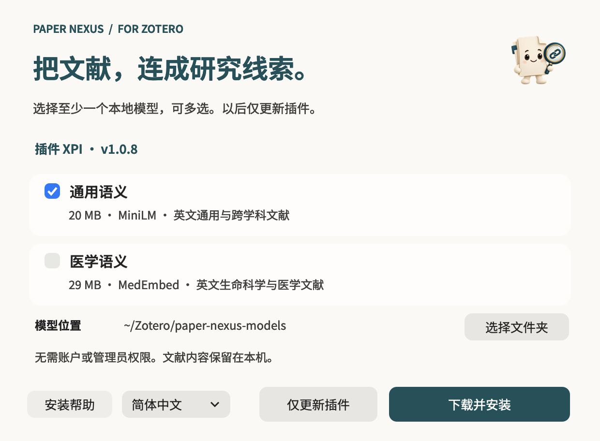

# 安装与更新

[返回首页](../README.md) · [使用指南](GUIDE.md) · [常见问题](FAQ.md)

适用于 **Zotero 10.0.5–10.0.x**，支持 macOS（Apple Silicon / Intel）和 Windows x64。

## 首次安装

1. 安装并打开一次 Zotero。
2. 从[发布页](https://github.com/JunyanKang/paper-nexus/releases/latest)下载安装器：macOS 打开 `.dmg` 后双击其中的应用，Windows 直接运行 `.exe`。
3. 勾选至少一种主题分析方案，保留推荐保存位置，或点击 **选择文件夹** 自定义。
4. 点击 **下载并安装**，按提示选择 Zotero 配置；如 Zotero 正在运行，正常退出后继续。
5. 点击 **打开 Zotero**。如提示“待启用”，到 **工具 → 插件** 中启用 Paper Nexus。
6. 打开 PDF，开始阅读。

安装助手本身无需安装，完成后可以关闭并删除。macOS 无需拖入“应用程序”，使用后推出磁盘映像即可。首次下载需要联网。

## 选哪种方案？

| 方案 | 下载大小 | 适合文献 |
|---|---:|---|
| 通用语义 | 约 20 MB | 英文通用与跨学科文献 |
| 医学语义 | 约 29 MB | 英文生命科学与医学文献 |

可以同时安装，在 **设置 → 网络 → 主题分析** 中切换，也可日后补装。安装器只下载勾选的方案。详见[模型选择](LOCAL-MODELS.md)。

## macOS 提示无法验证开发者

确认下载来自官方发布页，尝试打开后，进入 **系统设置 → 隐私与安全**，找到 Paper Nexus 的提示，点击 **仍要打开** 并确认。macOS 12 的入口为 **系统偏好设置 → 安全性与隐私 → 通用**。

If macOS cannot verify the developer, confirm the download is from the official release page. After trying to open it, go to **System Settings → Privacy & Security → Open Anyway**. On macOS 12, use **System Preferences → Security & Privacy → General**.

以上步骤只适用于开发者验证提示。如系统报告文件损坏或恶意软件，请重新从官方发布页下载，不要关闭系统安全保护。

## 没有自动找到 Zotero？

插件文件保存在系统的 **下载/Paper Nexus** 文件夹。点击 **打开文件**，再到 Zotero 的 **工具 → 插件 → 齿轮 → 从文件安装插件** 中选择该文件。

如果自定义了模型目录，插件会自动识别；使用外接磁盘时，请先连接磁盘。

## 日后更新

打开 **设置 → 网络**，在页面底部点击 **检查更新**，找到新版后点击安装。也可开启自动更新。

已有模型时，安装器底部的 **仅更新插件** 可单独更新插件，无需重新下载模型。设置和稍后读清单会保留。

1.0.1 及更早版本请先通过新版安装器升级一次，再使用插件内更新。

[开始阅读](GUIDE.md) · [探索文献网络](NETWORK.md) · [调整设置](SETTINGS.md)
