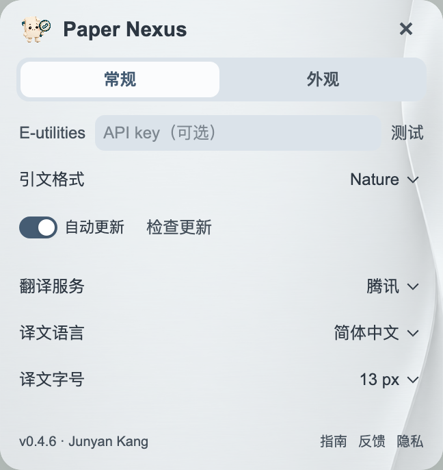

# 安装与更新

[返回首页](../README.md) · [开始使用](GUIDE.md) · [常见问题](FAQ.md)

当前版本 **1.0.1**。提供 macOS（Apple Silicon / Intel）和 Windows x64 安装器。

## 首次安装

1. 安装并打开一次 **Zotero 10.0.5–10.0.x**。
2. 在 [发布页](https://github.com/JunyanKang/paper-nexus/releases/latest) 下载对应系统的安装器，解压后打开。
3. 选择至少一个本地模型，可同时勾选多个。确认 Zotero 数据目录，点击 **下载并安装**。
4. 完成后点击 **打开插件文件夹**。在 Zotero 中选择 **工具 → 插件 → 齿轮 → 从文件安装插件**，选中安装器准备好的 `.xpi`。
5. 打开 PDF。在 Paper Nexus **设置 → 常规 → 本地模型** 中选择已下载的模型，即可开始探索网络。

安装器本身免安装，解压即用，完成后可以删除。它内置插件，模型从 GitHub 按需下载。每个所选模型分别显示下载量、速度与进度，校验安装完成后变绿。无需另行安装 Python、Node.js 或后台服务。

## 选择本地模型

| 模型 | 下载大小 | 适合的使用方式 |
|---|---:|---|
| 轻量通用 · 推荐 | 约 20 MB | 日常文献库、跨学科阅读；首次构建更快，占用较低 |
| 生命医学 | 约 29 MB | 英文生命科学和医学文献；首次构建较慢，占用较高 |

可以只装一个，也可以同时安装、随时切换。插件的切换列表只显示已安装的模型；点击 **下载** 可补装其他模型，也可以重新打开安装器。已安装的完整模型会直接复用。

插件、模型和个人文献索引分别保存。日后更新 XPI 不会重复下载模型。各模型的索引分别保存，切回原模型可以复用已有计算。

如果使用自定义 Zotero 数据目录，请在安装器内选中包含 `zotero.sqlite` 的目录。可在 Zotero 设置的“高级 → 文件和文件夹”中查看该位置。

首次使用安装器需要联网。需要离线安装时，可在可联网的电脑上准备 XPI 和 [独立模型包](https://github.com/JunyanKang/paper-nexus/releases/tag/models-v1.0.0)，复制到目标电脑，从 Zotero 安装 XPI，并在本地模型一行点击导入图标选择 `.pnmodel`。

## 模型与插件更新

模型行的检查图标用于检查**模型更新**；页面底部“检查更新”用于更新**插件**。下载中断可重试，已经装好的模型会保留。

发布页上的两个安装器供首次使用；单独的 `.xpi` 供已有用户更新，`updates.json` 由 Zotero 自动读取，无需手动下载。

## 第一次打开文献网络

选择自己的文献库或文献夹后，插件读取题名、已有摘要和作者信息，在本机生成网络：

- **主题**：本地模型计算研究内容的相似关系，按主题组织论文；只有题名也可参与。
- **作者**：按完整署名汇总论文，用共同发表的论文连接作者。
- **后续变化**：新文献、修改和删除在后台更新，已完成的计算尽量复用。

首次建立索引会显示处理进度。这个过程是使用已训练好的模型分析文献，不会重新训练模型；每位用户的网络由自己的文献库生成。

本地主题分析无需联网。PubMed／PMC 摘要查询、在线翻译，以及用户启用的大模型主题命名需要联网；大模型服务按所选厂商要求配置密钥。

## 第一次阅读

悬停正文中的引用标记，查看对应文献卡片。悬停卡片题名打开摘要；点击书签稍后阅读，或点击保存将文献放入 Zotero 文献夹。

点击工具栏图标打开本篇参考文献列表，再点一次收起。点击主面板的网络图标，可浏览本地作者与主题网络。

## 更新

在 Paper Nexus 中打开 **齿轮 → 常规**，在页面底部点击 **检查更新**。发现新版本后，点击安装按钮。

开启“自动更新”后，Zotero 会按自身更新机制检查新版本。若 Zotero 的全局插件更新已关闭，可继续使用手动检查；也可以重新下载最新 XPI，在同一个插件管理页面安装。

早期 **CiteLens 0.3.3** 用户请手动安装一次新版 XPI。升级沿用原插件身份，原有设置和稍后阅读清单继续保留。

## 下一步

- [阅读、摘要翻译与保存](GUIDE.md)
- [浏览作者和主题网络](NETWORK.md)
- [图标、摘要和更新常见问题](FAQ.md)
