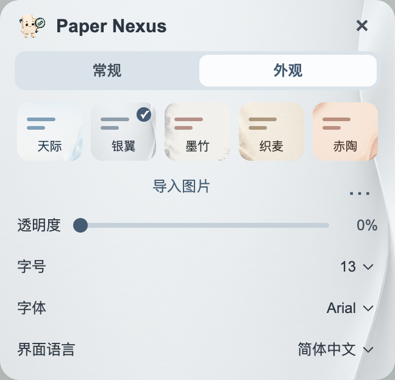

# 界面与交互

[返回首页](../README.md) · [使用指南](GUIDE.md)

Paper Nexus 与 Paper Voice 使用同一套紧凑面板语言：柔和圆角、统一字体、主题内的选中背景、按需出现的操作。品牌图标使用具象纸张角色；功能图标使用清晰的线性符号。

## 一次只处理当前任务

| 界面 | 主内容 | 次级操作 |
|---|---|---|
| 引文卡片 | 题名、作者、期刊指标、所在文献夹 | 右上角保存／打开、书签、更多 |
| 摘要 | 原文、译文、双语；关键词 | 顶部来源链接，空白区拖动 |
| 本篇文献／阅读清单 | 搜索与条目 | 行内详情、引用位置、批量保存 |
| 研究工作区 | 范围、搜索、作者／主题网络 | 节点详情、引用来源、扩展引文 |
| 设置 | 常规、外观 | 模型服务配置在译文内打开 |

网络和设置入口在各面板中统一为图标，并保留可访问名称。主题覆盖主窗口、次级页、下拉选项、提示、等待、错误、选中与禁用状态。Zotero 自身的原生对话框仍由宿主绘制。

## 多篇引用与摘要

多篇引用连续排列，每篇有独立圆角收边，不使用顶部分页。作者保持一行，超过六位显示前三与后三。DOI 链接在题名后，期刊论文不重复出版社。已有记录显示文献夹路径。

摘要与所属卡片保留 6 px 间隔，配对色标指向当前条目，四角始终圆润。控件行空白可拖动，正文仍可选择。支持左右上下吸附，遮盖卡片时根据可用空间及交叉边缘选择位置；没有外部空间时回到内联布局。

移出题名不关闭摘要；点击 Zotero／PDF 其他位置、进入其他条目或按 Esc 才关闭。清单按钮再次点击可收起，展开／收起继承 Paper Voice 的连续动画策略；启用系统减少动态效果时简化动画。

## 设置与可访问性

 

设置宽度 324 px，顺序为常规、外观。字体读取本机可用列表，摘要原文与译文共同使用外观字体；译文字号可独立调整。主题纹理默认启用。界面语言与翻译目标语言独立。

隐藏滚动条但保留滚轮、触控板和键盘滚动。网络支持方向键平移、加减号缩放与 Enter 查看节点；图标提供名称，焦点按所在窗口管理。进入设置后暂时隐藏父界面，关闭后恢复原位置。小窗口压缩留白并调整主次区域，不把按钮或长题名挤到窗口外。

摘要四边与四角支持调整宽高，顶部空白处移动。复制引文、定位引用、书签、更新与设置使用不同线性图标。文本按钮、开关、状态文字和下拉控件不附加重复提示；没有文字标签的图标仅保留一处主题化说明。完整作者名、DOI 和指标年份／学科详情按需保留。提示在窗口边缘自动调整位置，离开控件或关闭窗口后消失，同一时间只显示一处。
