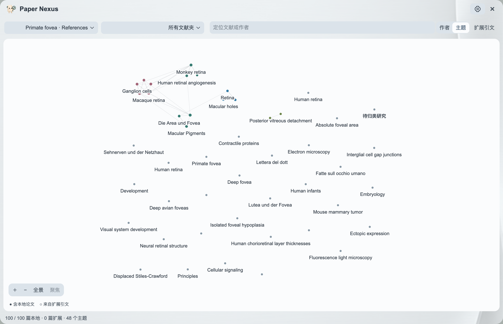

# 浏览文献网络

[返回首页](../README.md) · [使用指南](GUIDE.md)

从主面板右上角的网络图标进入，也可以使用 Zotero 工具菜单中的 Paper Nexus。

## 从主题或作者出发

| 视图 | 圆点代表什么 | 连线代表什么 | 点击后 |
|---|---|---|---|
| 主题 | 一个研究主题 | 所含论文之间的引用或内容关联 | 展开该主题的论文，查看论文列表 |
| 作者 | 一位完整署名的作者 | 共同发表的论文 | 查看其论文和合作作者 |

主题名称使用研究短语；悬停、选中和右侧详情使用同一名称。作者跨年份汇总，节点名称不带年份。每对节点只画一条线，线宽随去重后的关联依据增加。

## 定位与聚焦

首行可以选择文献库、文献夹，搜索论文或作者。选择搜索结果后定位到对应位置；论文尚未展开时，会展开其所属主题或作者的论文。

点击“聚焦”集中浏览当前节点的直接关系，点击“全景”回到整体。论文详情提供摘要、所在文献夹、打开条目、阅读全文和稍后读等操作。

## 扩展参考文献

选中主题、作者或论文后点击“扩展引文”，读取其本地 PDF 中的参考文献。没有选中节点时，扩展当前范围内已经读取的引文。

新引文直接加入当前视图：主题模式将其归入研究主题，作者模式根据完整作者信息加入合作网络。已在本地库中的同一篇文献会合并显示。实心节点包含本地论文，空心节点来自扩展引文；点击后可继续查看或保存论文。

## 随文献库增长

新增、修改或删除条目后，网络在后台更新。已有题名和摘要向量、相似度索引与主题名称会被复用，只重新处理变化的内容；扩展引文采用相同流程。更新时保留当前画面和节点位置，角落显示进度，可以继续平移、缩放和查看已有结果。

第一次打开时显示初始化动画和处理进度。点击尚未完成的结果会提示“正在进行中，请稍后”。取消后，已经完成的缓存会保留，下一次可继续使用。

默认使用完整 XPI 中的本地模型与运行组件，无需密钥、额外下载或训练。每位用户的网络由自己的 Zotero 文献库生成；首次打开建立的是语义索引，不会修改模型参数。在“常规 → 主题分析”选择“大模型 · API”后，模型会根据各主题的代表性题名和摘要提炼名称。翻译与主题分析可以共用同一服务商的密钥，并分别选择模型。

## 移动画布

| 操作 | 效果 |
|---|---|
| 双指滑动／拖动画布空白处 | 平移 |
| 捏合／鼠标滚轮 | 围绕指针缩放 |
| 拖动节点 | 调整并保留位置 |
| 方向键 | 平移 |
| 加减号 | 缩放 |
| `0` 或“全景” | 回到整体视图 |
