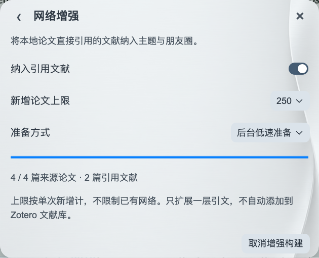

# 浏览文献网络

[返回首页](../README.md) · [使用指南](GUIDE.md)

点击主面板右上角的网络图标，选择要浏览的文献库或文献夹。

## 按主题发现研究方向

切换到主题视图，查看文献库中的研究方向。点击一个节点团进入其中的主题，再点击具体主题查看论文。搜索关键词可以同时突出多个相关方向，便于比较和继续探索。

## 按作者探索合作关系

切换到作者视图，输入姓名并选择结果，以这位作者为中心查看合作网络。**一级**显示直接合作者，**二级**增加这些作者的合作关系。点击作者可查看相关论文。

总览中的节点团可预览部分真实成员。群组间距反映现有资料支持的相对联系：合作更紧密的作者群组、研究内容更接近的主题群组通常更靠近；距离不是精确的相似度刻度，没有合作证据的作者群组也不会仅因主题相似而合并。

圆点代表主题或作者，连线表示关联；较粗的线表示有更多关联依据。悬停圆点或名称，两者会一起高亮，直接关联的节点保持清晰。

## 进入、返回与定位

| 操作 | 效果 |
|---|---|
| 点击节点团 | 进入成员网络 |
| 点击主题或作者 | 查看相关论文或合作关系 |
| 单击画布空白／Esc | 返回上一级 |
| 双击画布空白 | 返回全览 |
| 点击搜索框的清除图标 | 清空搜索并恢复总览 |
| 双指滑动／拖动画布空白 | 平移 |
| 捏合／鼠标滚轮 | 缩放 |
| 拖动节点 | 临时拉动，松手后平滑回位 |
| 点击适应视图图标 | 完整显示当前网络 |

## 阅读网络中的论文

论文列表在题名下显示可用的期刊、年份、卷期与页码。点击论文查看摘要，使用右侧三联图标在**原文、译文、双语**之间切换。悬停作者行可展开完整名单；使用详情中的图标打开 Zotero 条目、阅读全文、打开 DOI 或加入稍后读。

## 准备与更新

首次使用需要等待网络准备完成，右上角会显示进度，期间可继续阅读。新增或修改文献后，网络会自动更新。

默认只展示所选文献库或文献夹中的论文。分析在本机完成，无需 API key。需要更换主题分析方案时，前往 **设置 → 网络**，参见[模型选择](LOCAL-MODELS.md)。

## 网络增强

打开网络左上角的“网络增强”，启用 **纳入引用文献**，可把本地论文直接引用的研究纳入主题和朋友圈。尚未打开的论文也可通过公开引文来源准备，无需逐篇打开 PDF。

- “新增论文上限”按单次增强计算，可选 **250、500、1000 篇或不设限制**，不限制已有网络。达到上限后点击“更新网络”可继续下一批；不设限制时仍分批低速准备，可随时取消。
- 默认后台低速准备，也可选择仅查看网络时准备；可随时取消构建，保留已取得的资料并在之后继续。关闭网络窗口不会取消任务，只会降低后台处理速度。
- 空心节点表示仅由外部引文支持的主题或作者，实心节点包含本地文献依据。
- 朋友圈连线仍然表示共同署名；引用关系不会被当成合著关系。

只纳入直接引用的文献，不继续递归扩展。新增资料保留在插件引用索引中，不会自动填满 Zotero 文献库；关闭增强即可回到本地范围。公开引文覆盖因论文而异。

## 更新网络

点击“更新网络”图标，重新检查当前范围中缺失的摘要并更新当前网络。主题网络先完成本轮摘要检查，再聚类和命名；准备期间显示对应的构建动画，完成后显示完整网络。无法连接服务时保留上次完成的网络并提示重试。朋友圈无需等待摘要。

参考文献来自 PubMed／PMC、Semantic Scholar、Crossref 或已读 PDF。NCBI API key 为可选项；未填写也可查询。可获得的参考文献和摘要以各来源提供的资料为准。
