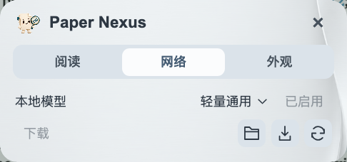

# 设置与服务

[使用指南](GUIDE.md) · [文献网络](NETWORK.md) · [模型选择](LOCAL-MODELS.md)

设置分为 **阅读、网络、外观** 三页，分别处理阅读与翻译、网络分析、整体外观。

## 阅读

文献信息放在上方，摘要翻译在下方：

- **E-utilities**：API key 可留空。点击名称打开注册页面；填写后离开输入框保存，点击“测试”确认连接。
- **引文格式**：选择 APA、AMA、MLA、NLM、Vancouver 或常用生命科学／医学期刊格式，供文献卡片的复制引文按钮使用。
- **翻译服务**：腾讯、微软、Google 或“大模型 · API”。
- **译文语言、译文字号**：调整摘要译文；字体跟随外观页。

底部是**自动更新／检查更新**，以及版本、指南、反馈与隐私入口。

## 网络

主题分组、主题命名和作者合作网络均在本机完成，无需填写网络 API。

- **本地模型**：选择已安装的模型并启用。
- **下载／导入**：添加其他本地模型，或从模型包安装。
- **模型文件夹／检查更新**：选择存放位置，检查已安装模型的新版本。

新增或修改文献在后台更新，不变内容复用已有结果。模型文件与插件分别更新。

## 翻译大模型

在阅读页选择 **大模型 · API**，再点击 **配置大模型**。使用腾讯、微软或 Google 翻译时不显示此入口。

选择服务商，填写密钥；模型可从下拉列表选择，也可手动输入。**保存并测试**用内置示例句检查翻译连接，不发送文献库。更换接口地址时，需要填写该地址对应的密钥。

右上角的**更新模型**同步厂商推荐模型和接口预设，并在厂商支持时查询当前密钥可访问的模型。手动修改的模型及已保存密钥对应的接口地址会保留。

## 外观

点击方块选择主题，点击“…”展开更多主题，也可导入自己的背景图片。透明度只调整背景，字体、字号和界面语言统一应用于卡片、摘要、菜单与网络。

界面语言与摘要翻译语言分别设置，例如使用中文界面阅读英文原文或日文译文。
