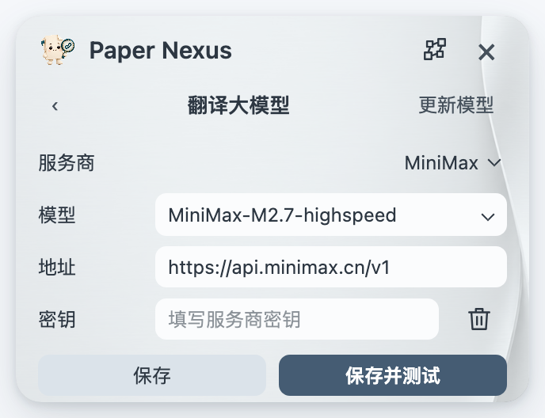

# 让 Paper Nexus 适合你的阅读习惯

[产品首页](../README.md) · [使用指南](GUIDE.md) · [安装与更新](INSTALL.md)

点击齿轮打开设置。**阅读**管理引文与翻译，**外观**调整整个插件的视觉体验。

## 摘要翻译

在阅读页选择翻译服务、目标语言和译文字号。腾讯、微软或 Google 等普通服务可直接选择；如使用自己的大模型服务，选择 **大模型 · API**，再打开下方的 **配置大模型**。

1. 选择服务商，填写 API key。
2. 从下拉列表选择模型，或手动输入账号可用的模型名。
3. 点击 **保存并测试**，成功后回到摘要窗口选择译文或双语。

根据自己的账号选择翻译服务与模型。

点击 **更新模型** 可刷新列表。若连接失败，确认密钥、模型名称与接口地址属于同一服务。自定义接口请使用对应服务提供的地址与密钥。第三方服务的权限与费用以其说明为准。

## 引文与期刊信息

在 **阅读** 页选择复制引文时使用的格式，支持 APA、AMA、MLA、NLM、Vancouver 及常用生命科学、医学期刊格式。

**E-utilities API key** 可留空，不影响基本文献查询。如已有 key，可填入后点击“测试”；点击 E-utilities 名称可前往申请页面。

阅读相关的选择集中在一页。

## 插件更新

在 **阅读** 页底部点击 **检查更新**，或选择自动更新。版本号、指南、反馈与隐私链接也集中在这里。

设置窗口右上角的网络图标可直接打开朋友圈。从单篇文档进入时，还可通过文献列表图标回到原来的列表。

## 主题与界面语言

在 **外观** 页点击色块选择主题，点击“…”浏览更多主题，也可使用自己的背景图片。界面语言会统一应用于文献卡片、摘要、菜单和网络；译文语言可在阅读页单独选择。

用同一套外观贯穿整个阅读空间。

界面语言与摘要翻译语言相互独立，例如用中文界面阅读英文原文或日文译文。

[返回使用指南 →](GUIDE.md) · [了解数据与隐私 →](PRIVACY.md)
